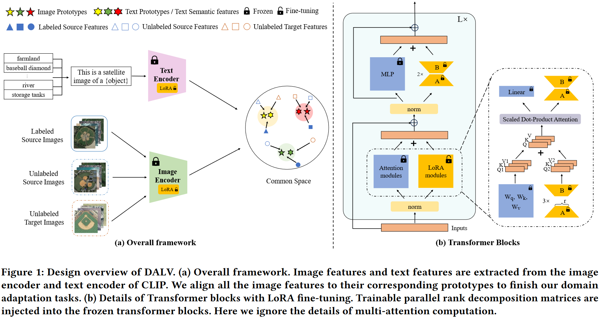

# DALV

The official implementation of the paper "Domain Alignment with Large Vision-language Models for Cross-domain Remote Sensing Image Retrieval".

## The Framework of DALV
<p align="middle">

</p>

## Dependencies

This is the list of the main package versions required for our experiments.

```txt
python==3.8.18
pytorch==1.13.1
scipy==1.10.1
tqdm==4.66.1
h5py==3.10.0
loguru==0.7.2
```

## Data Preparation

1. Download Dataset
* [AID, UCMD, NWPU](https://github.com/GeoRSAI/PCLUDA)
* [PatternNet](https://sites.google.com/view/zhouwx/dataset)
* [VBing, VArcGIS](https://faculty.csu.edu.cn/houdongyang/en/zdylm/198203/list/index.htm)

2. Prepare File Structure
Please put all the datasets under the ```data```. The prepared directory ```data``` would look like:
```
data
├── AID
│   ├── agricultural/
│   ├── baseball diamond/
│   ├── ...
│   ├── database.txt
│   ├── test.txt
│   ├── train.txt
│   ├── val.txt
├── UCMD/
├── NWPU/
├── PatternNet
│   ├── airplane/
│   ├── baseball filed/
│   ├── ...
│   ├── database.txt
│   ├── test.txt
│   ├── train.txt
│   ├── val.txt
├── VBing/
├── VArcGIS/
```

## Training and Evaluation
1. Train the model. For example, the running process on AID $\rightarrow$ UCMD (A $\rightarrow$ U) task when setting the label ratio as 0.1
```
python run.py --dataset_mode AID_UCMD --log_dir logs --lora_all --phase train_semi --ratio 0.1
```
3. 

## Acknowledgment
